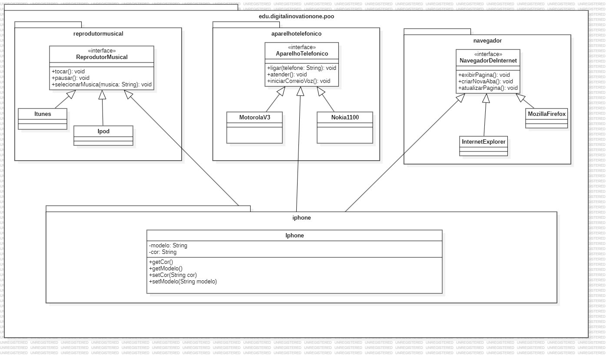

# 📱 iPhone - Projeto Java
Bem-vindo à Mula Store, onde você adquire o clássico iPhone 2007 em sua versão digital!
Este projeto simula o comportamento de um iPhone, implementando funcionalidades de telefone, navegador e reprodutor musical via terminal seguindo as orientações do curso de Java da plataforma DIO.

## 💡 Objetivo educacional
Esse projeto foi criado com fins de praticar conceitos de orientação a objetos, como interfaces, herança, encapsulamento e modularização de código em Java.

## 📦 Funcionalidades
Após iniciar o programa, você poderá:

- Escolher o modelo do iPhone (4GB ou 8GB)
- Escolher a cor (Preto ou Branco)
- Decidir se deseja ligar o iPhone ou não
- e Navegar pelo menu interativo, com as opções:

### ☎️ Aparelho Telefônico
- Ligar para um número
- Atender chamada
- Iniciar correio de voz

### 🌐 Navegador de Internet
- Exibir uma página por URL
- Adicionar nova aba
- Atualizar a página

### 🎵 Reprodutor Musical
- Tocar música
- Pausar
- Selecionar música por nome

## 📊 Diagrama UML
Abaixo está o diagrama UML representando a estrutura das interfaces e a classe Iphone:
O diagrama mostra a implementação das interfaces AparelhoTelefonico, Navegador, e ReprodutorMusical pela classe Iphone.

